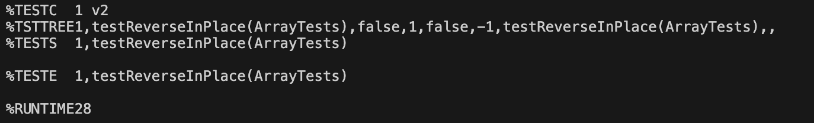

# Part 1 - Bugs

```java
static void reverseInPlace(int[] arr) {
    for(int i = 0; i < arr.length; i += 1) {
      arr[i] = arr[arr.length - i - 1];
    }
  }
```

**A failure-inducing input for the buggy program, as a JUnit test**

```java
@Test 
public void testReverseInPlace() {
    int[] input1 = {1,2, 3 };
    ArrayExamples.reverseInPlace(input1);
    assertArrayEquals(new int[]{ 3,2,1 }, input1);
}
```

**An input that doesn't induce a failure**

```java
@Test 
public void testReverseInPlace() {
    int[] input1 = { 3 };
    ArrayExamples.reverseInPlace(input1);
    assertArrayEquals(new int[]{ 3 }, input1);
}
```

**The symptom, as the output of running the tests**

**Failed Test**


**Passed Test**


## Bug Code Before and After
**Before**
```java
static void reverseInPlace(int[] arr) {
    for(int i = 0; i < arr.length; i += 1) {
      arr[i] = arr[arr.length - i - 1];
    }
  }
```
**After**
```java
static void reverseInPlace(int[] arr) {
    for(int i = 0; i < arr.length / 2; i += 1) {
      int temp = arr[i];
      arr[i] = arr[arr.length - i - 1];
      arr[arr.length - i - 1] = temp;
    }
  }
```
The issue with the Before code is that it attempts to reverse the array in place by changing elements with their corresponding elements from 
the end of the array. However, this overwrites the original values before they are stored. The After code fixes this issue by iterating only 
up to half of the array length and using a temporary variable `temp` to store the original value before it is swapped. Therefore, each 
element is swapped with its corresponding element from the end of the array without overwriting the original values prematurely.

# Part 2 - Researching Commands

1. **Option: `-E` or `--extended-regexp`:**  
<br>Command Line with text file: `norazajzon@Noras-MacBook-Air-2 biomed % grep -E '\[ [0-9 ]+ \]' 1471-2091-2-9.txt`
<br> Output: 
<br> `ATPases [ 1 ] . Three isoforms that differ in the ratio of
        secretion, regulation of hemostasis and ectokinases [ 1 ] .
        [ 1 ] . The specific activities of NTPDases vary over a
        [ 9 10 ] . Sequence comparisons indicate that most of
        conserved region, ACR1 - ACR5 [ 9 11 ] . However, the
        respectively [ 9 ] .
        catalytic function [ 12 ] . Substitution of H59 in ACR1
        dependent manner [ 13 ] . Mutation of W187A in ACR3
        ADPase activity [ 14 ] . Mutations of D62 and G64 of ACR1
        superfamily [ 15 ] . These results suggest that the
        carboxypeptidase [ 16 ] , S-adenosylmethionine synthetase [
        17 18 ] , pyruvate kinase [ 19 20 ] , and F 
        1 -ATPase [ 21 22 ] . This cation
        cofactor [ 23 ] . Vanadyl has one axial and four equatorial
        equatorial metal ligands [ 24 ] , binding of VO 2+to CD39
        purified from insect cells [ 25 ] . Only one
          the nature of VO 2+equatorial ligands [ 22 ] . Of the
          || but not A⊥ [ 21 26 ] . In this
          presence of metal [ 25 ] .
        ligand [ 24 27 ] . By studying the EPR spectra of bound VO
        decreased rate when VO 2+replaces Mg 2+ [ 21 ] .
        only one nucleotide binding site [ 25 ] . The g and A
        1 -ATPase [ 22 28 ] , the γ- and
        1 -ATPase [ 21 ] , pyruvate kinase [ 19
        20 ] , AdoMet synthetase [ 17 18 ] , and carboxypeptidase [
        hydrolysis [ 25 ] , sCD39 probably has two conformations
        protein [ 2 25 ] . The two EPR species observed with VO
        that only ATP analogs were detected on sCD39 [ 25 ] .
        groups [ 25 ] . When ADP is the substrate and generates
          cultured as described by Chen and Guidotti [ 25 ] .
          Soluble CD39 were purified as described [ 25 ] with some
          according to Houseman et al. [ 21 ] . Dissolved molecular
          accomplished with the computer program QPOWA [ 30 31 ]
          constants obtained from model studies [ 24 32 ]
          for equatorial donor group i [ 24 ] . Similar equations`
<br> This command line option allows the grep to interpret patterns as extended regular expressions within the text file given. The regular expression is identifying the pattern for [ number ] and returning the search hits that match the pattern. Ex: [9 11] or [ 4 ]
<br> Command Line with working directory: `norazajzon@Noras-MacBook-Air-2 biomed % grep -E '\[ [0-9 ]+ \]' --directories=recurse`
<br> Output
<br> `./1471-2202-4-3.txt:          of the precursor [see [ 31 ] ]. Another possibility could
`<br>`./1471-2202-4-3.txt:          somatostatin have been observed [ 33 34 ] . This
`<br>`./1471-2202-4-3.txt:          indicated [ 15 ] . Finally, we hope that our study will
`<br>`./1471-2202-4-3.txt:          disease [ 8 ] .
`<br>`./1471-2202-4-3.txt:          human brain of Haines [ 36 ] , and the same atlas was
`<br>`./1471-2202-4-3.txt:          addition, the atlas of Paxinos et al. [ 37 ] was
`<br>`./1471-2202-4-3.txt:          series of densities [ 38 ]` . . . 
<br> This command line option allows the grep to interpret patterns as extended regular expressions within the working directory. The regular expression is identifying the pattern for [ number ] and returning the search hits that match the pattern. Ex: [9 11] or [ 4 ] (Output was shortened)

2. **Option: `-v`:**
<br>Command Line for text file: `norazajzon@Noras-MacBook-Air-2 biomed % grep -v 'e' 1471-2091-2-9.txt`
<br> Output: `Background
`<br>`catalytic function [ 12 ] . Substitution of H59 in ACR1
`<br>`A and 
`<br>`CD39.
`<br>`VO 2+as cofactor
`<br>`2 ] 
`<br>`activity.`
<br>Explanation: This option displays all lines in the specified text file that do not contain the specified 'pattern' which in this case is e (returns all lines that do not use e).
<br>Command Line for directory: `norazajzon@Noras-MacBook-Air-2 biomed % grep -v ' ' --directories=recurse`
<br> Output:
<br>`n./1472-6807-2-2.txt:
`<br>`./1471-2350-4-3.txt:
`<br>`./1471-2156-2-3.txt:
`<br>`./1471-2156-3-11.txt:
`<br>`./1471-2121-3-10.txt:
`<br>`./1471-2172-3-4.txt:
`<br>`./gb-2002-4-1-r2.txt:` . . .
<br>Explanation: This option displays all lines in the all text files in the working directory that do not contain the specified 'pattern' which in this case is ' ' (returns all lines that are empty).(Output was shortened)

3. **Option: `-n` and `-G`:**
<br>Command Line for text file: `norazajzon@Noras-MacBook-Air-2 biomed % grep -n -G '21' 1471-2091-2-9.txt`
<br> Output:
<br> `44:        catalysis. E174 in ACR3 and S218 in ACR4 are required for
`<br>`51:        and D219 and G221 of ACR4 demonstrated that the nucleotide
`<br>`65:        1 -ATPase [ 21 22 ] . This cation
`<br>`135:          21 ] . The intensity of -5/2 
`<br>`140:          || but not A⊥ [ 21 26 ] . In this
`<br>`248:        21 ] because the g and A tensors of the 51V hyperfine
`<br>`260:        decreased rate when VO 2+replaces Mg 2+ [ 21 ] .
`<br>`280:        1 -ATPase [ 21 ] , pyruvate kinase [ 19
`<br>`346:        on ACR3, D213 (D219 in HB6) and S218 on ACR4 dramatically
`<br>`355:        This hydroxyl group (S218?) probably interacts with the
`<br>`359:        hydrolysis is likely contributed by D213 since it is close
`<br>`360:        to S218.
`<br>`438:          according to Houseman et al. [ 21 ] . Dissolved molecular`
<br>Explanation: This option makes it easy to find the exact location of the pattern in the file by displaying the line numbers as a prefix and the matched lines. -G option interprets patterns as basic regular expressions, in this case "soluble".
<br>Command Line for directory: `norazajzon@Noras-MacBook-Air-2 biomed % grep -n -G 'non-hydrolyzable' --directories=recursee`
<br> Output:
<br>`./1471-2091-2-9.txt:264:        non-hydrolyzable analog of ATP) complexed with VO 2+was
`<br>`./1471-2199-3-7.txt:37:        stable complexes with non-hydrolyzable ApppA in which two
`<br>`./1471-2164-3-18.txt:595:        presence of either Mg.ATP or a non-hydrolyzable ATP-analog`
<br>Explanation: This option makes it easy to find the exact location of the pattern in the files in the working directory by displaying the line numbers as a prefix and the matched lines.  -G option interprets patterns as basic regular expressions, in this case "non-hydrolyzable".

7. **Option: `-m NUM` and `-F`:**
<br>Command Line for text file: `norazajzon@Noras-MacBook-Air-2 biomed % grep -m 3 -F 'soluble' 1471-2091-2-9.txt`
<br> Output:
<br>`Recently we reported that a recombinant soluble CD39,
        soluble CD39 in the presence of Ca 2+when non-hydrolysable
        purified soluble CD39. The possible metal ligands for VO`
<br>Explanation: This option in the grep command is used to limit the number of matches returned by grep. It specifies the maximum number of matching lines to be displayed in the specified text file. The fixed string is identifying the string "souble" within the text.
<br>Command Line for directory: `norazajzon@Noras-MacBook-Air-2 biomed % grep -m 3 -E '\[ [0-9 ]+ \]' --directories=recurse`
<br> Output:
<br>`./bcr620.txt:        with cell lines show that tumor cells can bind soluble OPN
`<br>`./1471-2156-4-5.txt:        function. Disease-causing myocilin mutants are less soluble
`<br>`./1471-2180-2-22.txt:        systems, forming a fluorescent, insoluble CTC-formazan. The
`<br>`./1472-6807-2-1.txt:        high-resolution structure of a soluble acetylcholine
`<br>`./ar130.txt:        physical support and critical soluble factors [ 43]. Our
`<br>`./1471-2253-2-5.txt:          the alveolar values. For extremely soluble solutes such
`<br>`./1471-2091-2-13.txt:        as a soluble protein in the .` . . .
<br>Explanation: This option in the grep command is used to limit the number of matches returned by grep. It specifies the maximum number of matching lines to be displayed in all files in the working directory. The fixed string is identifying the string "souble" within the text.

Work Cited:
https://man7.org/linux/man-pages/man1/grep.1.html
https://chat.openai.com/
Prompts include: generate a regular expression for grep to find a pattern with the following syntax: [  an unspecified number ]
